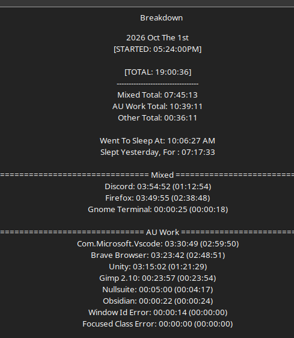

# Work Log 1  - 1/2nd of october 2026

# Sup fuckers

i worked until i literally passed the fuck out and couldn't type anymore. 

UH

Did a lot of work on Daemon Protocol now that we have...everything figured out. 
the entire character creator is being hammered into place... 

just lots of work on that. 

instead of how AOA's work where its multiple pieces. 

This is just one big ass scene full of everything. so its taking more time than
"Well i got CCspecies done" 

nah. i got the overwhelming majority of it done. 

just need to create some species, and histories for it now.

CAUSWE were adding species and histories to DP cause i can :)

Also gonna beautify and add helpers to the char creator 

so when yo usee action points you can click it and find out wtf they are
before yo ucomit to a choice. 

just.......a lot of work yo. idk everything i did. 

