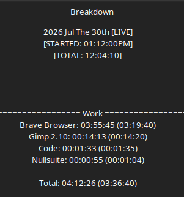

# Work Log 10

# Personal Note

I'm recovering from a pretty nasty infection that knocked me out for a few days. That's why there haven't been many work logs recently. At one point I was barely awake for more than a few hours a day, so development was effectively on hold.

Thankfully, I'm feeling much better now and getting back into the project.

## Steam Store Page Revisions

Today's development focused almost entirely on improving Daemon Protocol's Steam presence.

I revisited the store page with fresh eyes, making a number of adjustments to both the written content and overall presentation. The goal wasn't to change what the game is, but to communicate it more clearly to someone seeing it for the first time.

Several sections were rewritten or refined to better explain the project's direction while keeping the page concise and easier to read. Small wording changes ended up having a much bigger impact on the overall flow than expected.

## Visual Improvements

Continued polishing the Steam page's visual presentation.

Created and updated graphics to better represent the project and improve the first impression for anyone visiting the page. While these changes don't affect gameplay, they're an important part of making the project look more professional and approachable.

## Steam Community Post

Prepared the next Steam community update for release.

Reviewed the post, refined its wording, and ensured it accurately reflected the current state of development before scheduling it for publication.

## Closing Thoughts

Today wasn't about adding new gameplay systems—it was about presentation.

A good first impression can be just as important as a new feature, especially for an unreleased game. Taking the time to improve the Steam page now should make it much easier for future players to understand what Daemon Protocol is trying to accomplish.
