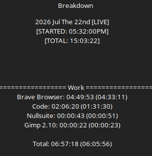

# Development Log 5

Today's work focused primarily on improving project documentation and community resources.

## Wiki Foundation

Work began on a dedicated wiki system for documenting Daemon Protocol's mechanics, systems, and lore. While still in its early stages, this establishes a centralized location for future documentation instead of relying solely on Discord messages and GitHub READMEs.

## Communication Documentation

A separate GitHub repository, **ProsodyVexbaneStyle**, was created to document my writing style and communication conventions.

While unrelated to Daemon Protocol itself, the goal is to make online communication clearer by explaining how I use punctuation, formatting, and emoticons to convey rhythm, tone, and facial expressions in text.

It also gave me an excuse to publicly version-control my own communication style, which is objectively hilarious.

## Scavenging System Redesign

The scavenging system was heavily reconsidered.

Originally, scavenging was divided around location-specific loot pools. While functional, this created unnecessary separation between locations and crafting materials.

The system has been shifted toward a trade-based structure. Stolen from Ashes of Arcanum, to mimic universe familiarity.

Instead of towns determining crafting resources, trades now define the available special materials:

- Alchemy
- Blacksmithing
- Fabricator
- Lapidary
- Medic

This creates a clearer identity for each crafting path.

---

## Scavenging Behavior

Scavenging now has multiple levels of commitment.

Passive activity while exploring still provides loot, but it will not provide Special trade materials.

Players can actively search with:

!s

This allows the player to find Special materials from any trade.

Players can also specify a trade with:

!s Medic

!s Alchemy

!s Blacksmithing

This allows targeted searches for a specific crafting profession.

However, focused scavenging comes with increased danger.

---

## Fatigue System Integration

Focused scavenging now ties directly into fatigue.

The goal is to make scavenging a risk decision rather than a button to repeatedly press.

Fatigue:

- Increases while actively scavenging.
- Increases creature spawn risk.
- Reduces combat effectiveness.

Every 5% fatigue reduces all d100-based rolls by 2.

This affects:

- Attack rolls
- Damage rolls
- Protection checks
- Ability checks
- Other percentage-based mechanics

Fatigue therefore becomes an expedition management system rather than simply a timer.

---

## Fatigue Recovery

Fatigue cannot be instantly removed.

The only recovery method is spending time in town.

While in town:

-5% fatigue every 30 minutes.

This makes towns a true recovery point instead of simply being locations used for menus and crafting.

Players must decide when to return before their expedition becomes dangerous.

---

## Fatigue Threshold Warnings

Warning messages will appear as fatigue increases.

Planned thresholds:

10,25,50,75,90,95,99 in percentiles. 

At extreme fatigue levels, travel and survival become increasingly difficult.

---

## Scavenging Architecture

The scavenging system will likely move under the Allocator process.

Reason:

Allocator's responsibility is inventory management.

Scavenging ultimately results in:

- Item generation
- Inventory changes
- Equipment creation
- Stack management

Axiom should handle world events and activity checks, then request inventory changes from Allocator.

This creates clearer process ownership:

### Axiom

Responsible for:
- World simulation
- Town systems
- Town boons
- Activity tracking
- Encounters

### Arbiter

Responsible for:
- Battles
- Turns
- Combat resolution

### Allocator

Responsible for:
- Inventory
- Item creation
- Scavenging rewards
- Trading
- Crafting-related item changes

---

## Special Scavenging Materials

Trade identities were expanded and refined.

### Alchemy

Nature-focused materials.

Examples:

- Mandrake
- Nightshade
- Wolfsbane
- Ghostcap
- Voidbloom
- Quintessence

---

### Blacksmithing

Direct, logical materials.

Examples:

- Copper
- Iron
- Bronze
- Brass
- Titanium
- Adamantium
- Ceramite

---

### Fabricator

Synthetic and chaotic materials.

The naming style intentionally follows Eimon influence.

Examples:

- Ruskin
- Belran
- Venum
- Venim
- Karlith
- Virax
- Vokin
- Vokun

---

### Lapidary

Crystal-based materials.

The naming reflects the creators behind them.

As Tynos named the crystals to clear corruption during the war. They follow a phonetic pattern.

Corruption-aligned crystals follow structured naming conventions:

- Serenite
- Luminite
- Elarium
- Holium
- Clestra
- Ascendra

Delirium-related crystals intentionally break those conventions as they were named by the Eldrians

How this information persisted in Icolass, we don't know.

Here are the names:

- Ysqareth
- Myrqeth
- Izhketh
- Zinktesqtum
- Xerethqum

The contrast between ordered naming and eldritch naming reinforces the lore behind their creation.

---

### Medic

Medical supplies follow a human-readable catalog style.

Common:

- Bandage
- Antiseptic
- Tweezers
- Ointment

Uncommon:

- Gauze
- Disinfectant
- Clamp
- Gel

Rare:

- Dressing
- Antibiotic
- Forceps
- Hydrogel

Special:

- Charcoal
- Glycerin
- Tannin Powder
- Lidocaine
- Iodine
- Epsom Salt
- Menthol
- Lanolin
- Glycol
- Calamine

---

## Development Direction

Today's biggest realization was that several systems were becoming cleaner by removing unnecessary separation.

The goal moving forward is not to add more systems, but to ensure existing systems have clear ownership and purpose.

Scavenging, fatigue, towns, and inventory now reinforce each other instead of existing as isolated mechanics.

The next step is likely finishing core gameplay content before expanding implementation of additional systems.

A mechanic does not deserve to exist because it can be coded.

It deserves to exist because removing it would make the game worse.

... Also. To not start coding mechanics while the game is still flipping concepts, and being stress tested by myself.

## Equipment Modifier Expansion

Today's work focused on expanding the equipment modifier system rather than introducing new mechanics.

Several new weapon modifiers were added to create more distinct weapon identities while avoiding simple "more damage" upgrades.

### New Positive Weapon Modifiers

- **Accurate** — Increases Critical Chance.
- **Weighted** — Increases Stagger Chance.
- **Reliable** — Raises the weapon's minimum damage roll, making damage output more consistent.
- **Punisher** — Increases Critical Damage.

The addition of **Reliable** is particularly interesting, as it changes the feel of a weapon rather than simply increasing its average damage. Weapons become more dependable by reducing low damage rolls instead of only increasing maximum potential.

### Negative Modifier Planning

Work also began on expanding the pool of negative weapon modifiers.

Rather than relying solely on straightforward stat reductions, the goal is for negative modifiers to describe flaws in the weapon itself. Concepts such as poor balance, inconsistent performance, reduced stopping power, or diminished critical potential better communicate why the weapon performs worse.

This keeps positive and negative modifiers feeling like characteristics of the equipment instead of arbitrary numerical buffs and debuffs.

### Design Philosophy

One realization during this process was that weapon modifiers are significantly harder to design than armor modifiers.

Armor naturally supports a wide range of passive statistics such as defenses, resistances, and weaknesses. Weapons, however, define how the player actively interacts with combat.

Because of this, weapon modifiers should focus on altering the weapon's handling, consistency, and combat identity rather than simply stacking additional damage bonuses.