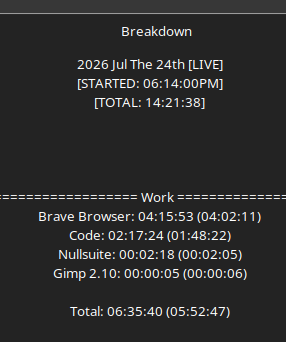

# Development Log 6

Today's work marked the beginning of Daemon Protocol's transition away from Python's nested dictionary structures and toward a proper object-oriented architecture in C#.

Rather than focusing on gameplay mechanics, the majority of the session was spent building the foundation that future systems will rely on. While this resulted in relatively little visible gameplay, it dramatically simplified how future content will be created.

## Creature Architecture

The Creature class was fully established.

Instead of storing creatures inside deeply nested dictionaries, every creature is now represented as its own object containing its complete set of statistics and properties.

This allows creature data to be created in a single location while remaining significantly easier to read and maintain than the previous Python implementation.

One realization during this process was that constructors are not inherently bad. Since every creature is only ever created during database initialization, a larger constructor actually keeps creature definitions compact and readable.

---

## Creature Database

The Creature Database was redesigned.

Rather than organizing creatures through multiple dictionary lookups, each region now maintains its own list of creatures.

For example:

- Halcyon Creatures
- Vector Creatures
- Meridian Creatures
- Praxis Creatures
- Echelon Creatures

Because the database itself already determines which town a creature belongs to, redundant location information was removed from each creature.

Sub-locations were also eliminated in favor of simpler directional identifiers, reducing duplicated data while making spawning logic easier to understand.

The overall result is a database that better reflects how the game actually uses creature information instead of how it happened to be stored.

---

## Item System Foundation

Work then shifted toward creating the game's item architecture.

A dedicated Item class was created to represent all non-equipment items in the game.

Each item now stores standardized information including:

- Name
- Description
- Targeting
- Item Type
- Rarity
- Associated Trade

This provides a common structure capable of representing crafting materials, consumables, quest items, and future inventory objects.

Separate database classes were also established for:

- Items
- Weapons
- Armor
- Equipment Modifiers

This separation keeps each content category independent while remaining easy to expand over time.

---

## Enumerations

One of today's largest improvements was replacing many string values with enumerations.

Instead of repeatedly typing values such as:

"Common"

"Crafting"

"Alchemy"

The engine now references predefined enum values.

Current enums include concepts such as:

- Rarity
- Item Type
- Targets
- Trades

Besides eliminating spelling mistakes, this provides compiler validation, autocomplete support, and much cleaner code throughout the project.

The realization here was that enums are essentially part of the engine's vocabulary. They define every valid state for systems rather than relying on free-form strings.

---

## Data Organization

Another architectural realization occurred regarding global definitions.

Originally there was concern over where enums and shared definitions should live.

The conclusion was that GameDatabase serves as the central location for engine-wide definitions, while specialized databases simply manage their own collections of data.

This creates a clear separation between:

- Global engine definitions
- Content databases
- Individual game objects

Each component now has a much more obvious responsibility.

---

## Trade Material Population

With the underlying architecture established, work finally shifted into actual content creation.

The first trade materials for Alchemy were entered into the database.

Materials were organized into tiered crafting progression covering Common, Uncommon, and Rare resources while distinguishing between Base materials and Essences.

Although manually entering items initially appeared repetitive, it quickly became apparent that creating new content is now significantly faster than it was under the previous data structures.

Instead of fighting architecture, the majority of the work simply became defining game content.

---

## Development Philosophy

Today's biggest realization was that engine architecture is beginning to stabilize.

Much of the effort spent during previous development sessions involved deciding *how* systems should exist.

Today's work represented a shift toward simply filling those systems with content.

The project feels considerably closer to reaching the point where development consists primarily of creating creatures, items, equipment, and gameplay rather than repeatedly redesigning the underlying engine.

The architecture is no longer becoming more complicated.

It is becoming easier to build upon.

---

Not a bad set of work for.. a day off, I'd say.

Whoops
