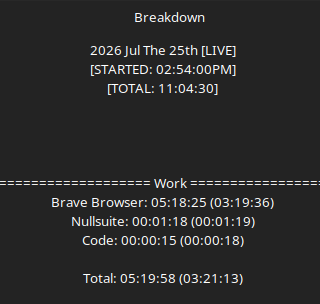

# Development Log 7

Today's work shifted away from game development and almost entirely toward documenting the Ardron Universe itself.

Rather than implementing new mechanics, the focus became establishing a permanent historical archive for the setting. While this produced very little gameplay, it greatly strengthened the world's internal consistency and will make future development significantly easier.

## The Ardron Universe Wiki

The majority of today's work was spent expanding the official Ardron Universe Wiki.

What initially began as a simple lore repository quickly evolved into something much larger. Instead of merely recording facts, each page became an opportunity to better define motivations, philosophies, and the historical impact of the universe's most important figures.

The realization throughout the session was that documenting lore often reveals unanswered questions just as effectively as creating it.

---

## The Gods of Creation

Most of the day centered around documenting the original Gods.

Rather than writing short summaries, each deity received a proper historical biography explaining:

- Their philosophy.
- Their relationship with their Mana.
- Their role during the Ten Thousand Year War.
- Their lasting influence on the universe.

This transformed the Gods from simple world-building concepts into historical figures with understandable motivations and flaws.

The pages also established a consistent writing style that will serve as the foundation for future lore entries.

---

## Character Refinement

Writing encyclopedia articles required examining each God's personality far more critically than before.

Rather than asking what each God did, the focus shifted toward understanding *why* they made those decisions.

Several pages were rewritten multiple times as motivations became clearer during the writing process.

Small wording changes often resulted in significantly stronger characterization, particularly when describing political decisions, philosophical disagreements, and moral boundaries between the Gods.

The documentation itself became a form of world-building.

---

## Post-War Perspectives

A surprising amount of time was spent exploring how the Gods changed after the war.

Instead of treating personality traits as static descriptions, they gradually evolved into reflections of who each God became after experiencing the destruction of the world they had helped create.

This gave several characters considerably more emotional depth while maintaining consistency with previously established lore.

---

## Zykius' Research Logs

Recovered journal entries belonging to Zykius were drafted and formatted for the wiki.

Rather than functioning as exposition, these logs provide small windows into his state of mind throughout the millennia following the war.

Some entries remain lighthearted, showing his dry humor despite impossible circumstances, while others quietly reveal the emotional burden of becoming the last God still actively maintaining the universe.

These records helped establish Zykius as more than simply the God of Knowledge. They present him as a researcher who continues his work not because success is guaranteed, but because no one else remains to continue it.

---

## Historical Consistency

One of today's largest accomplishments was improving the consistency of the universe itself.

As pages began linking together, inconsistencies became much easier to identify. As few as there were.

Questions that previously existed only as loose ideas were finally given definitive answers, while relationships between major historical events naturally became clearer.

Rather than creating entirely new lore, much of today's work involved strengthening what already existed.

The setting now feels less like a collection of ideas and more like an actual recorded history.

---

## Development Philosophy

Today's work reinforced an important realization.

The wiki is no longer simply supplemental documentation.

It has become the canonical historical archive of the Ardron Universe.

Instead of maintaining multiple versions of the same lore across different games, future titles can reference a single source of truth while focusing on telling their own stories.

Ironically, writing documentation accomplished exactly what good engine architecture should accomplish.

It organized complexity.

The universe itself is beginning to feel less like scattered notes and more like a place with a recorded past.

---

Five hours disappeared into writing.

Not because new mechanics were added...

But because the world those mechanics exist within became far more real.