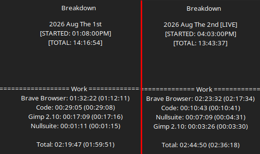

# Work Log 1

# Three Days

Yeah After my bout of sickness, I came back kind of defeated. 

Depressed, weak, not at fully 100%. 

So I decided to take the first and Second of August off. 

Or so I thought. 

## Website Fixes

I fixed some things in the Quiz and Linktree esque websites.

primarily made resolutions for all desktops work regardless 😃

and fixed a button not working.

## Falatur...

So During my 2nd day off, i felt kinda good. still didn't want to really work though? 

So a friend was invited over, and me and the cule, and she had a good time.

In that good time, we played Dagorhir(technically), and it made me dust off my old notes. 

and I had to have a good thought to myself. 

"Do I just want to make Dagorhir+, and make them change more rules... OR is the whole system flawed, and i'll take these old notes of ABSWA and make it into something new"

Welp. 

Falatur is that something new. 

instead of just trying to improve on Dagorhir, i'll just make my own system. with blackjack, and hookers. 

Dagorhir is nice, but it has some...glaring flaws, and some rules that were made for people with thin bones, and some... very stupid restrictions elsewhere. 

Go play Belegarth? nah. Amtgarde? Nah. 

Already did that way back in the day. Time to fire up my old system again...but better. 

---

I'll be going back to my very first roots where I made AoA.... Homebrewery.naturalcrit.com

Could make my own website. Could make a list of .md's for github. but thats all lame. 

No one goes to github for a rulebook cept hypernerds. 

PLUS i want it to be a PDF you can just download, and store, or browser that thing at any time.

Homebrewery does what i need. 

---

I've also been bouncing back and forth between the wiki. but there isn't much else to say about that besides "hey i filled in this part" like asking for a fucking "good job" sticker. 

So yeah. 

butts.
