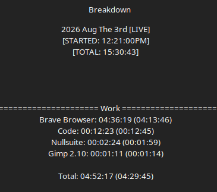

# Work Log 2

# WE RIDE AT DAWN

Version **0.1** of Falatur is complete.

What started as a handful of house rules slowly grew into a complete combat system, covering weapon families, construction standards, armor, combat mechanics, and general gameplay.

The one thing I'm not particularly worried about is safety.

Falatur's construction requirements weren't invented from scratch, they're built upon decades of proven practices from games like Dagorhir and Belegarth, then refined where I felt improvements could be made. Rather than reinventing weapon safety, I wanted to preserve what already works while encouraging construction methods that keep striking surfaces soft, consistent, and easy to inspect.

Now comes the fun part.

Time to build some weapons, gather some people, and see what survives first contact.

Version 0.1 is finished.

Version 0.2 begins the moment somebody finds something I didn't think of.

Live Link Here: https://homebrewery.naturalcrit.com/share/bxZshAifzLMP

---

Truth be told. I Kinda wanna keep working too... but I'ma say this is *it* just incase.