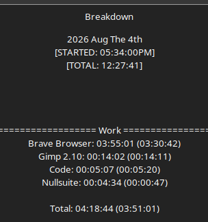

# Work Log 3

# Sorry >.> 

I meant to upload this yesterday BUt. i was... hella deep in foamsmithing.

I was writing out a guide to create foam arrow heads, and swords and what not for falatur. 

i looked at a bunch of ways people do it compared to the way i already was going to do it and...it scarily lined up. 

BUT i don't have the materials to start crafting *right now* so i'll get onthat later. 

Other than that... did a bunch of shopping and such for:
1. crafting materials
2. archery things.

I have a samick sage thats 45 lbs...and i pull 31" so its more like 50lbs. 

NOT good for Falatur, but WILL be good for durability testing on my arrowhead build.

So. my wife sbow will be 25lb.s i'll be doing stress tests of the arrow heads with *that* first. as its rated for Falatur. 

THEN i'll let her do body shots, and then face shots once i test hte durability of my build.

..Then I"ll let her do body and face shots at the 45 lbs...even tho it isn't legal. it MIGHt up the poundage you can use for Falatur if the arrowheads are safer, 

I do this becaue the arrowheads...being made to be safe, are CHONKY. so. a stronge rbow can actually make them go further reliably. So it needs tested. 

SO. 

100 shots at 25lbs:
- 10 feet. 
- 20 feet. 
- 30 feet.
 will be done with the same arrow, and same arrow head, on the same bow... 

Then with a new arrow:
100 shots at 50lbs:
- 10 feet.
- 20 feet.
- 30 feet.
will be done with the same arrow and same arrow head, and same bow... 

We'll see how it lasts. 

If test are favorable on the 50 lb.... we'll move onto body shots and headshots with the 50lb. if NOT...we'll stop. 

The arrows will be inspected every 10 shots at regular intervals. 
this will be even more brutal on the arrowheads because...

There will be the soft 2lb density foam on the tip. it will ONLY be the EVA on it. for literal worse case scenario. 

I will be shooting directly at my house. The cinderblock wall. 

very hard surface. 

This is the absolute worse case scenario for the arrowheads... I will test them until they break.

SO ANYWAYS. thast what i planned, discussed. made blueprints of the build, and a buidl guide, did price comparisons. all that shit. 

that was my work log yesterday C:

