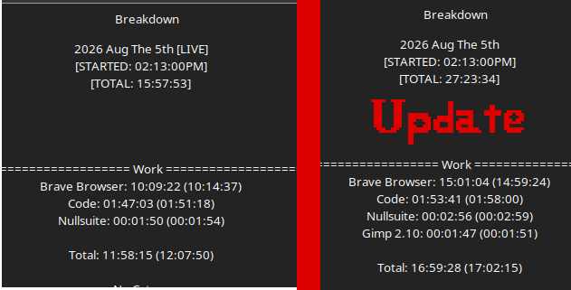
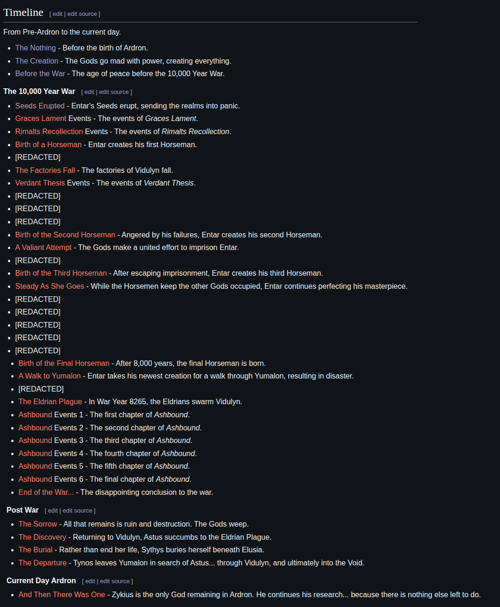

# Work Log 4

# HOLY DAMN

Good work day. :D

I've been filling that wiki with *stuff.*

On the lore side of things, I decided I didn't just want to write a list of historical events.

Nah.

I'm giving it personality.

As you can see... that's **just** the lore section.

It's huge.

I've got a *lot* of writing ahead of me.

The plan is to write Ardron's history from the perspectives of the Gods themselves. Instead of reading like a dry encyclopedia, every major event is told through the eyes and minds of the people who actually lived it.

That means every God has their own voice, biases, and way of thinking.

After that...

🤷

No idea how long that'll take.

I'll probably bounce around to other tasks here and there.

We'll find out.

For now though...

It's lore time.

Making history fun to read.

More of a novel...

Less of a wiki.

---

i got about 3 more hours before i gotta do other things... Probably gonna write more. 

add 3 hours to that clock for Brave. 

Brave browser is where i do all my "Work" related things on browers. 

the wiki. writing steam pages. editing Falatur. so yeah. Brave is not my liesure browser. Thats firefox. 

---

Update:

called it >.> i ended upw riting and working until i had to do adulting things.. uh lol. 

ah well :) bigworkday. i feel like trash now :D 