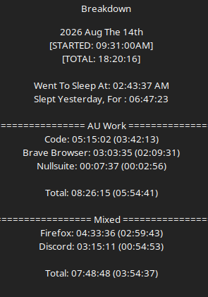

# Work Log 9

# Deamon Protocol Work

:D I'm sick! got some sort of flu, uh. 

did A LOT of daemon protoocl work.  

slotting in weapons to the C# engine. 

Getting socket to socket ocmmuncation things going. 

getting the Login command for the server goin. 

shit is moving along BEAUTIFULLY. 

i don't even remember all i was doing. 

i was just so god damn happy to be coding in C# i didn't even make notes of what i did. 

i was just flyin. 

in the 3489723784 hours it took me to setup nested dictionaries and all that shit in p ython. 

took me about 2 hours, to just... make classes in C#, 

the "you need to be super specific" thing in C# that people hate? i love. its probably the autism. who knows. 

BUT it lets me know. hey. i aint makin errors. ifi was. C# woudl yell at me. 

SO WERE GOLDEN> 

didn't post this 2 days ago cause i had a bestie come over, and we hung out and i forgot to post so ¯\_(ツ)_/¯oh well. 

