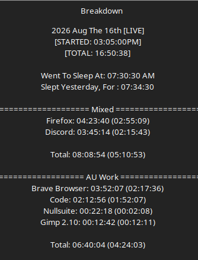

# Work Log 10

# we did... a lot of things honestly. 

FIRST THINGS FIRST :D 

I did some discord work, and set up all the permissions and channels, and setup ko-fi for the new NFSO server. added quite a bit of stuff. 
so that "mixed" timer? yeah thats why discord is mixed. 
its both work  and liesure :V same with firefox. (butfirefoxismostlyliesure)

UHHHH we also released Falatur 0.2 with some updates to weapon classifications and better stuffffff. 

uhhh. 

we did A LOT of data entry for Daemon Protocol. 

got all player C# classes setup and tasty, same with all item C# classes. 
and got all that data in EXCEPT weapon familes........as i'll be updating them. 

also changes wepaon families to levels 1-25 incase someone wants to change their wepaon. they don't get shafted by having to wait until level 100 to fuckin use any abilities. 
i know that shit scks in ESO. 

levesl past 25 will give a passive boost to using that weapon.

uhhhhhhhhh. fuck. idk. i did a lot. im loopy and sick. so i thought data entry would be a good best. :3 it was. 

anyways. toodles. 

