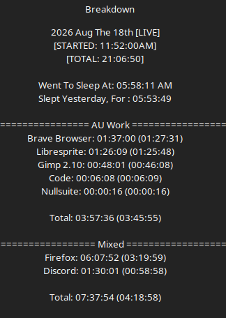
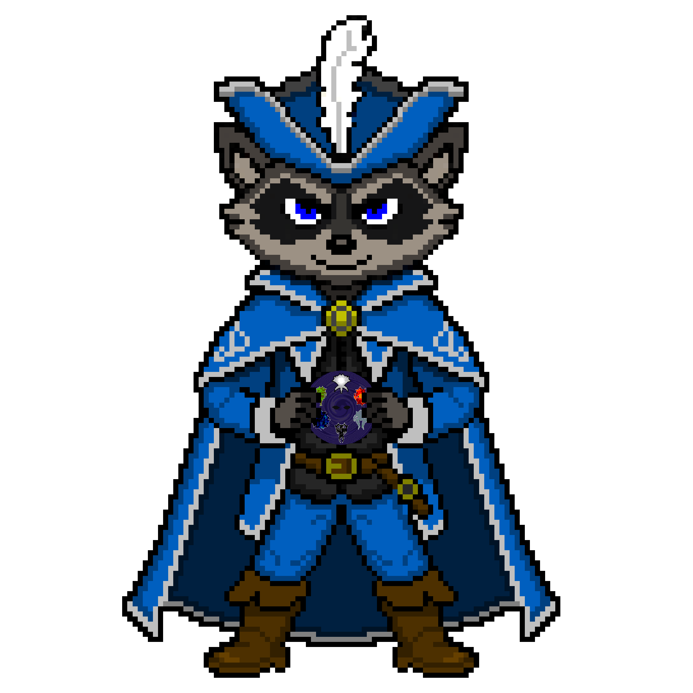

# Work Log 12

# Still Heccin Sick. Part 2.
So. thing came up. had to spend like 4 hours outside cleaning things up, and setting things up so. 

That was fun while hacking up a lung

UHHH

Redid the art for the blue mage raccoon, cause i don't want to steal the design COMPLETELY from final fantasy, so I kind of designed my own look to it. 

Real happy with that one. Gotta work on my pixel art skills. that thing took like 2 hours. Gotta get faster. Got games to make. but practice is needed.

---

UHHH had a breakthrough for daemon protocol DLL's.........i unded 2 of the DLL's i did yesterday, 

BUT in turn. 

swapped a sostrum to an elusia. 
created a new sostrum
and already have three tier 2 DLL's for the new sostrum one, it just came that easy. so i'm going to say it was the right choice.

