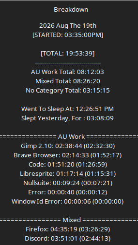

# Work Log 13

# Website Day

Today I worked on the NFSO website quite a bit. 

i got all of Auli's information. 
Added new fonts. 

...........and started working on pups page WHICH IS GOIGN TO BE A HUGE PROJECT >:3c

there is loads of sprites...buttons.....and things to setup. its gonna be great and completely unneeded, but itll be cool. i blame him. 

UHHHH

I also spen ta rediculous amount of time fixing a fucking NullFocus bug. 

sometimes when a window only pops up temporarily (e.g. a pop up add)

the window focuses to it
nullfocus gets that window ID
then it gets the windows na- oh sorry the windows already gone ¯\_(ツ)_/¯
welp... return an error. 

now it shows that.

This also seemingly happened when you X out of a window

...makes sense. 
→ focus
→ but hitting x so the window is destroyed in a millisecond
no more window, but its trying to process that. > error. 

SO YEAH THAT WAS FUN. 

this would lead to sometimes the focus loop just........fucking ending. 

So sometimes i'd be having Visual studio code on 2 monitors. 

I x out of the one on the right monitor.........................welp. it is now no longer tracking my fucking work because i x'ed out. it errored, and the loop stopped. 

so i've been tracking less hours than actually happened due to this fuckin bug.

usually what fixedit was completely closing the window its talled on, and reopening it. 

but i had no indication that it stalled so ¯\_(ツ)_/¯ 

BUT now it dont matter. 

it continues the focus loop regardless of the error or not, because...well i can't change how the entire kernal of linux mint works, lmao

also changed the format/lineup of the focus so all times are together now for easier reading.

so yeah. that was... my day. 

With this knowledge under my belt. I went back and checked times of the total days, and the wake time. 

there have been HELLA hours missed due to this bug. Just yesterday (before the fix) there was 2 hours and 3 minutes missing. 

so... like i said. idk how much i've been working and such due to... what nullfocus recorded is LESS than what I actually worked. 

i only say this affected "work" because... well it only happened when the program had to take extra time to sort a category. (look up race conditions. they're fun)

E.g. > fuckin work. 

SO YEAH. 

butts. 
