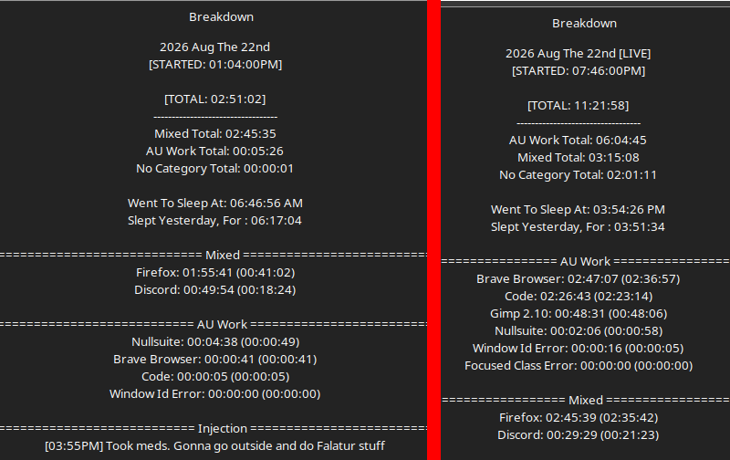

# Work Log 15

# A long day

Day started with 
"i'm gonna work on Falatur things"

proceed to go outside, and cut fiberglass rods. FUN. dangerous.  infurating. 

got that done. 

then i had to question ymself on my rapier length i wanted. 
and then i had to consult  "what counts as weapon lengtH" due to foam compression. 

added that rule to falatur 
added a BUNCH of judge info mation to falatur. 

uhhhh BUILT an archery and scrap box (yay)

aaaaaand did a pommel for the hammer whil ei figured out how to do it

soon as i came in side. i figured it out. angry. 
---

THEN i finished the NFSO website. pups page is complete, game and all. as far as i know. like i said. a long day -w- im tired. 

