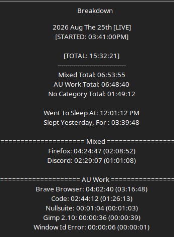

# Work Log 17

# Dp gittin DONE

Needed more supplies for falatur things. so. wiatin gon shipping. 

SO today we worked on daemon protocol DLL's. 

takes sometime cause they're basically...whole ass classes. 

BUT we got all of tier 1 done. and i want to say half of tier 2 🤨?

some movement from t1 to t4 as well cause of too m uch power and nothihng to build on. 

BUT YEAH. were gonna get there. 

DLL's will be the biggest meat of the game so. 

Best to tackle it first befor ei build the system and have to slot this shit in. 

:D so yeah. 

