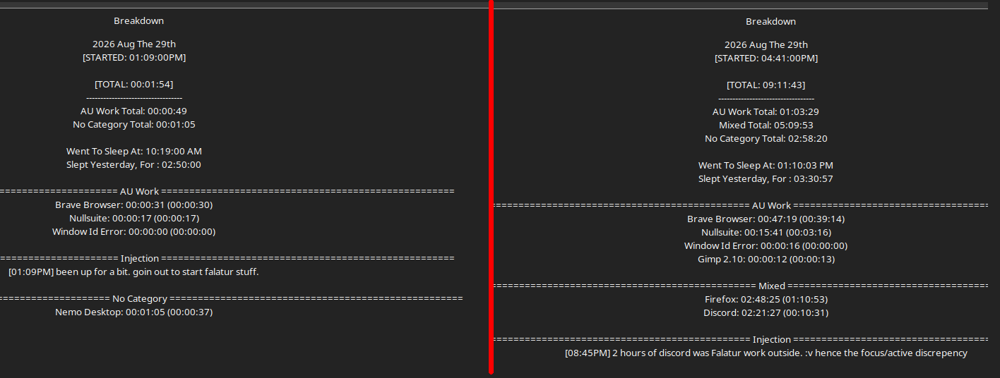

# Work Log 19

# FALATUR

after a measly 2h 50m of sleep. 

immediatnyl went outside and started sewing and setting up falatur stuff, and my best friendshowedup. 

lots of chatting and assistance was given, but still got things done. 

auli's axe is 100% finished. clothed. ready to go. legal. 

got strips for my rapier done. finished. good to go. 

....the hammer was a headache. and im going to do it differently. 

i basically made a tower of foam pieces..... 
2 inch 3 inch 4 inch 5 inch out of 12mm eva, then 6 7 8 9 10 out of blue camping mat
then a 10x30 piece to wrap around the haft.
wasn't long enough
wasted 1.5 hours waiting for it to dry to fuck with it more. 
then a 10x40 piece.
that one fuckin fit. 
wrapped that bitch. clamped it. left it. 

...and now im writing this in the morning, and i hate it. 

i know how to do it better now. it legit came to me in a dream :v fuck me. 

welp. 

gonna go do that. 
start log 20 with me goin the fuck outside. 

