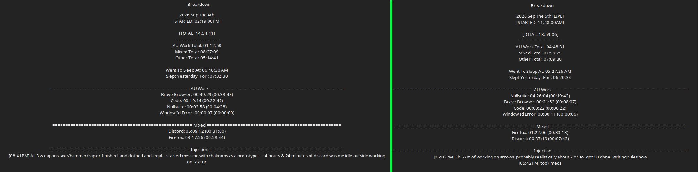

# Work Log 3 -  Sep 5th 2026 

# ARROWS

So. today i went outside and made some Falatur arrows. 
These things hurt. 
i certainly need better foam, but for the moment i used that polyfil type stuff. 1lb density 35 ild. 

its 1 inch thick. 

at 1 inch...it hurts. 
at 2 inch its the same as gorgs arrows.
i still need better foam however.  something 2 inches for sure. 

then we tested distance. 

at 0-14 feet... quarter draw
at 15-24 half draw
at 25+ feet you can full draw

now. feet is hard to scope out and adjust on the fly, but thats the safe ranges we set. 

Had to remove crossbows cause there is just no realistic way to safely pad the bolt and set draw distance, and measure draw poundage safely and a bunch of other things.

butyeah. did that. came inside. and chilled for many hours as the bestie is over. 

realized a small problem with NullSuite so...now sinks can go to 1000% volume ¯\_(ツ)_/¯

soyeahfuntimes. 

---

YESTERDAY since i forgot to post a log. 

Finished all 3 weapons. and made that chakram prototype. 

WORKS GREAT BTW. still flies. and its like getting hit with a squeaky toy at full thrown force. so totally doable. 

uhhhh. did quite a bit of work on nullsuite setting an update up

iiiii made it so nullwire unattached volume has a toggle. and set up the save file.
setup nullfocuses clipboard if you actually want it to do so, aand set up THAT save file.
and fixed the nullfocus start up UI. 

Also fixed the website a little bit. clickable links inthe info section didn't work. and my font evidently didn't wanna load :D so. fixed all that. 

---

good days
