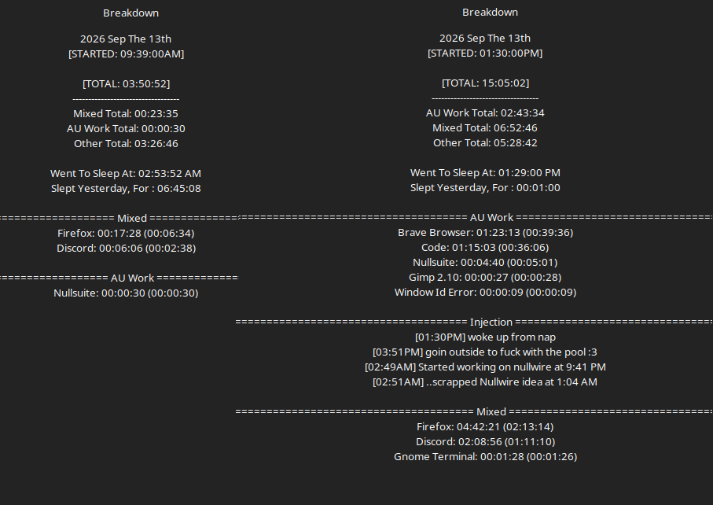

# Work Log 7 -  Sep 12/13 2026 

# We like to party. We like. We like to party

Dude i don't even remember the 12th. 
i stayed up for 27 hours............and then i slept for 2. i don't remember that day at all

---

the 13th uhhhh. things were happening. didn't get a chance to work MUCH. 

disasemmbled the pool, watched iron lung with the husband, did some more archery and testing. 

but while setting up iron lung i had an idea for nullfocus to add a delay effect..........fuck all that. would take dozens of hours of work. 

tried using easy effects...didn't work how i wanted. scrapped that idea too.

went back to nullwire. 

started working on the thing........and. yeah it was just a god damn mess. 

did like a good 3 hours of messing with things i think? and then scrapped it all. it was a mess of coding i wasn't gonna be prepared to get into. i need to work on real things.

soyeah. practically no progress made cept for 50 more shots of arrows....still holdin up. no damage to report ¯\_(ツ)_/¯
