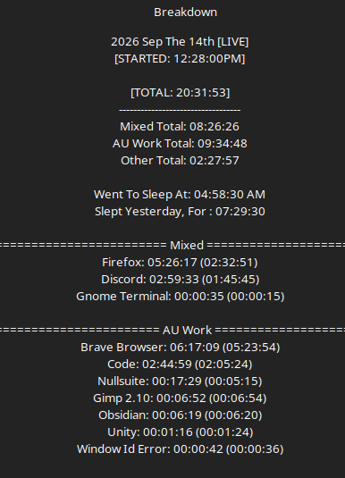

# Work Log 8 -  Sep 14 2026 

# IDK WTF to do

I legitimately do not know what i want to work on. 

i got a random burst of motivation to work on AoA.... as its...technically 95% done. 

- Tokens
- Playermap tools
- Spells
- Classes
- Bug Testing

after that the game is DONE....besides the tutorial and campaign to play. 

butalso.... DP is the better choice to work on as ...it will actually pull people the fuck in.

and then theres Graces Lament...the GAME game and start of the war and major turning point in the store. 

BUT ON THAT NOTE. i shoudl work on the lore books too...

gonna spend more time chosing what to work on rather than fucking working. 

There is no wrong choice..........but there is a right choice.

I just don't know what that choice is.

it's just. i've been outside working on this...for falatur. for WEEKS. basically a month. i need to be inside more. get Ardron stuff done.

like i don't feel like the falatur stuff was wasted time.  far from it. its part of work. butstill. 

I got more pouches to make too :V so yeah....idk. 

---

lmao did an update on nullwire injections for monthly recaps cause ...yaknow. UI n shit.

---

...did 2h 20 mins of. foam smithign research. found HELLA cheaper fiberglass, and good foam foundations 

did cost analysis if it could be a full thing. 

ehhhh

market prices are far too competative. 

I'd have to have a full production scale, and bulk to see any worth while profit if i wanted to undersell the market a bit.

my goal was 30$ for a basic 36" sword. which sells for around 45$ at the lowest at other places. 

cost of materiasl went from 24$ down to 12$. Goodshit. but now accounting for 3 hours of labor? 6$ an hour is.... not worth not working on games. 
even if they don't go anywhere.

Like I aint expecting the games to blow up. but the foamsmithing is physical labor. outside as my workbench is outside. no shed no protection from the elements. 
so

meh, the economics technically work. The opportunity cost and working conditions don't.

---

if it wasn't obvious. i keep this open all day now and kinda use it as my "work" diary.

---

Well instead of work i ende dup doing tax based things, and setting up halloween decorations...and other things. lol. such is mondays

---

Spent an hour and a half cooking dinner lol. :V now to eat. - this is why firefox has a 2h of active time missing from focus time. 

Focus(Active)

Active means >clicked on or pressed a key while the window was in focus within 15s. 

After 15s it stops counting "active" time. C: nullfocus is neat. kinda hard to believe i created it sometimes.

---

mmk so... discussed lore with a friend.  decided im going to actually write the prequals to the gods but only after the rest of the books are out. for reasons. 

ALSO

we got blue mana damage figured out. the answer was staring us int he face the whole time. and im mad i didn't figure it out sooner. 

well tbh. 

i figured it out by letting the lore speak. 

i had to stop that "no one will care" bullshit. and just...write it out where needed, and let it flow where needed. 

this was a flow. 

So after consulting my notes and AOa things. its been figured out. 

lol updated the Tales of Ardron github too. 

Also. renamed the horseman War to Wrath. 

LIKE. I KNOW. I changed the lore. im bad. 

In the original. his name is War. that's just how it is. 

BUT FOR US? im naming him wrath. so i don't have to type out "in the 10k year war, war did this" cause that is... awful. 

and other things. 

but anyways.

think ima work on spells now. 

tried opening DP...was meh. 

so yeah. 

AoA spells it is. 

ONWARD

---

AoA Spellwork:

Worked heavily on the Level 0 spell system, starting with Black Mana.

First finalized how Catalyst-required spells should be treated. Catalysts have 5 Jinx slots total: 2 are occupied by required Catalyst spells (the color's baseline/mastery attacks), while the remaining 3 are freely chosen by the player. Since the required spells exist as part of the Catalyst system and do not appear in the normal spell list, they will NOT count toward the player-facing total spell count.

This led to a target of 9 normal Level 0 spells per color where appropriate:
- 3 Offensive
- 3 Utility
- 3 Support

Players choose 3 of those 9 for their open Catalyst slots, allowing them to specialize completely in one category or mix categories however they want. This is useful symmetry rather than symmetry just for the sake of every Mana color having identical spell lists.

Black Mana work:
- Continued defining Black around darkness and Charisma rather than treating it as generic "evil/death magic."
- Black's associated stat is Charisma. Charisma intentionally has no skill list or derived modifier; Charisma checks are simply 1d100 + the Charisma stat.
- This gave Black's Support/Offensive spells a useful mechanical identity based directly around Charisma.

Also continued separating Catalyst attacks from normal spells:
- Darken = Black's baseline Dark-damage Catalyst spell.
- Wither = Black's Mastery/Necrotic Catalyst spell.
- These are necessary for Catalysts to function but are not counted as normal spells.

Current Black normal spell distribution after excluding Catalyst-required spells:
- 3 Support
- 3 Utility
- 2 Offensive after adding Falter
- 1 more Offensive spell needed to reach the intended 3/3/3 Level 0 pool.

General design realization:
Instead of inventing generic RPG spells to fill categories, Level 0 spells are being derived from what the Mana actually does and what its creator would realistically have developed/needed. Entar was already a researcher before gaining Black Mana, so Black Mana does not make him a researcher; he simply applies Black Mana's actual properties to his work.

Also discovered that Entar sounds catastrophically edgy when his otherwise extremely practical spell instructions are translated into Latin.

---

:V had chat gpt write that because i didn't know hwo to word it. 

---

Changed hwo the fuck AoA AP system works again... psychotically. 

30 total AP

quick = 2

small = 8

medium = 16

large = 24

instead of having QAP and AP.... i'm refactoring it into a single action point pool for simplicity :v 
but. 

you need to be able to do at least 3 quick actions per turn. 

3 smalls per turn maximum. + 3 quick

1 medium maximum per turn. + 3 quick

1 large maximum per turn. + 3 quick

at least 1 medium + 1 small. and still 3 quick. 

like... xD shits wild. 

anyways. onto the last black offensive spell

---

... done. aaaaaaaaaand i accidently cmae up with a 4th utility spell OH FUCKIN WELL.

started already abusing the new Ap system.........but i been up for 20 hours. ima go the fuck to bed now o.e

night people
