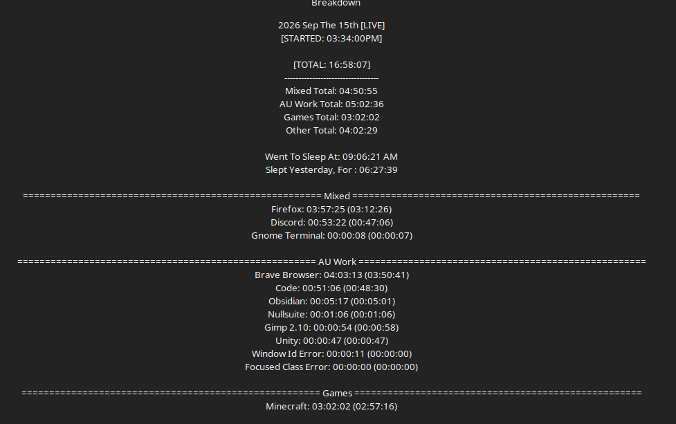

# Work Log 9 -  Sep 15/16 2026 

# Late start, but ...good reasons?

Woke up. Did things. 

peeps wife and bestie started playin Minecraft on the server i have setup. 

and well. bestie is on first shift. so... they go to sleep at 9 pm. so. times limited. 

So i decided to take my open time, with them :) 

Spend 3 hours playin minecraft, and a fuckin hour just getting minecraft to take my card so my kid could join us. Microslop at its finest. 

by time that was settled (had to go to target and buy a digital code there o.e and that took 42 minutes to get me the code), and the game was goin

... 

it was 9 pm, and bed time for the bestie since first shift. 

Then i had to do some house things. 

and THEn when all that was done... made dinner. 

:V now its 1 am. 

...

Time to start working 

---

:D well i was gonna work on spells. NOPe. its 3 am. 

and i just finished the TRELLO yayyy

seeing my mountain of work and everything. 

and showing it to a friend. 

mf said its a hydra. cut one head off and 3 more systems appear. and he gets why i have choice paralysis on chosing what to work on now. 

and the mf DLL list for DP is so large it lagged trello........wild

---

fixed the NFSO website. links weren't clickable :V made my background twice as dark too. was hard to read. 

---

Changed how spells work a lil bit :D now instead of mastery being a true/false. its now a bonus to jinxes and some spells.

---

got some blues done... just kept getting distracted/interrupted and other things. not alot done. oh well c: 

