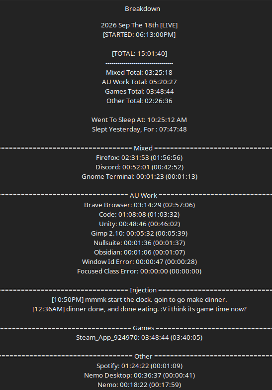

# Work Log 12 -  Sep 18/19 2026 

# Werealmostthere. 

through lots of trail and error. were almost there. 

---

I merged the overlord bot into the entire DP launcher cause butts. 

now i can control all 5 bots at once...

and even better...

SyncCommands = ["!roverlord","!update", "!raxiom","!rarbiter","!rallocator","!rall","!rmain"]

^ with a set of sync commands. i cannow restart/stop/start/update the bots just from typing commands in discord. :v i dont have to touch a damn thing.

cept if we lose internet/power. then its all manual restart lol. 

smol work day, but a good work day. i'll take 5.5 hours workin on that infrastructur eto keep things up and running more smoothly.

