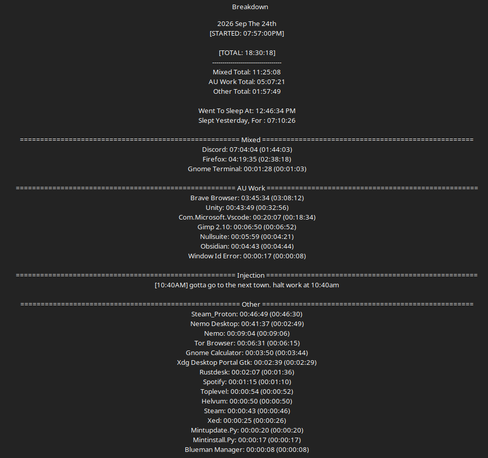

# Work Log 18 -  Sep 25/26 2026 

# Smol work day

Didn't do much. 

I started working on DP in Unity........and got side tracked with another piece of work. 

i started setting up stats. 

and then i had math to do. 

so. I took to chatgpt. put in numbers. answers were given. 

wasn't happy with these answers. 

wash rinse repeat for 3.5 fucking hours. 

i like to double, triple, and quadruple chekc my math. 

because if the shit is wrong, its peoples characters that are going to die on hardmode. 

and that is unacceptable. their death should be their fault, not the games, the engines, or the maths. 

so..had to figure out starting health, how much health you get per vitality point. 

how many points you get per level, and all that good shit. 

we basically tore the numbers apart constantly. 

This is high level probabilistic math, and calculations based on that. so yes. I was going to use an advanced calculator for that. e.g. chatgpt. suck it. 

Even after that i still double checked all the work myself, I just like a second opinion. 

so yeah. it was only about 5 hours of work in total...........but man was it a rough fuckin 5 hours.

after the 5 hours of math, and graphs, and dumb shit, and other things going on in my personal life, i was just done man.

had to go to the town over for other stuff. so yeah. roughday. had a lot of them recently. heres hopin it gets better :V

