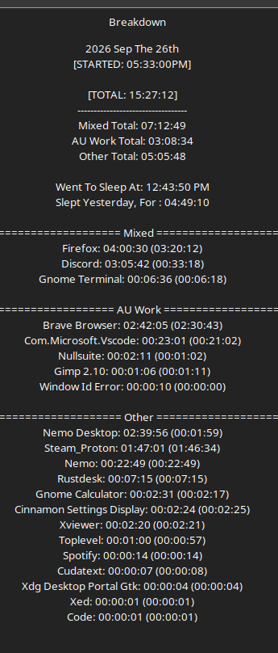
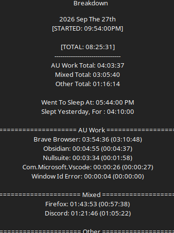

# Work Log 20 -  Sep 27/28 2026 

#  MOAR stats!

Look i had to build a fuckin porch today ok. but in the middle of that. 

i thought of making a "what are your REAL stats" quiz like the ardron quiz. 

so i did that. 

then i had to think what "average"

and it all devolved from there. 

only 3 ish hours of work before i had to quit but god my brain was tired after. 

==========================

lost track of my days... 
idk wtf happened. 

==========================

#  Goddamnit

So finally figured out the stat problem. 
which led to a skill problem. 
which led to another problem. 

andnow a lot of AoA and DP will be re-written. 

these problems mostly came from aping D&D... and now im ripping that skeleton out. 

---

**Untrained:** Get 5 successes.  
**Skilled:** Get 5 critical successes.  
**Master:** You're done.

but

unskilled = 1 negative dice stack. 
skilled = normal
master = 1 positive dice stack

---

Stats are now -100 to 0 to +100

ever + over 0 gives +total to skillcheck (+16 gives +16 to checks)

however. 

every 1 point below -25 is a -1 to the skillcheck. 

---

Stats are

# What the six stats actually mean

These aren't completely frozen yet, but the conceptual separation is becoming much clearer.

**STR — Strength:** physical force/output.

**DEX — Dexterity:** physical precision, coordination and controlled execution.

**VIT — Vitality:** bodily resilience, endurance and ability to withstand physical demands.

**INT — Intelligence:** cognition, information retention/processing, learned information, pattern recognition and reasoning from information.

**WIS — Wisdom:** intuition, inference and practical reasoning when information is incomplete—the elegant academic discipline known as **bullshitting**.

**PSY — Psyche:** psychological/emotional capability, both inward and outward. Emotional regulation, composure, psychological resilience/recovery, understanding emotions and reading other people's psychological states.

PSY specifically is **not a “mental health score.”**

Seeing some incomprehensibly horrific Ardron bullshit doesn't become:

> Roll PSY to simply not be traumatized.

You can still gain Delirium because **BRO, YOU LIVE IN ARDRON.**

PSY can instead influence things such as mental resilience, recovery, functioning under psychological pressure, emotional interpretation, etc.

And importantly:

> **Psyche isn't only YOUR psyche.**

It's also your capacity to understand other people's minds/emotions.

---

Stats generated are when rolling 
-55 + 5d20

Or on a scale of pointbuy. 

330 starting.

+200 for averaging. 

so 570

---

===

theres my notes for  everything that happened...it was........ alot. 

---

ON TOP OF THAT> 

i'll also be ...upgrading the website. 

instead of fighting miraheze and relying on them. might as well put my money into github because... well everything else is already on github. if that goes down the wiki wont fucking matter regardless will it?

so yeah...

Also working on a "whatwouldyourstatsbe" type quiz. so thatll be fun. 

...many things to do. not alot of time to do it. im already tired and i havn't started yet. fuck me. 