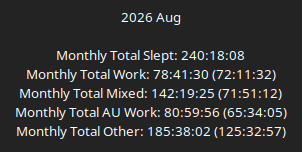
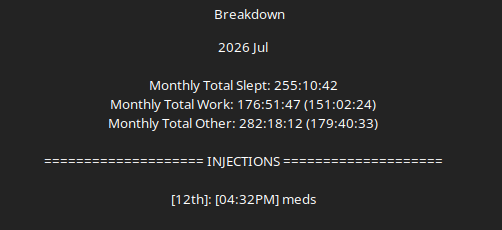
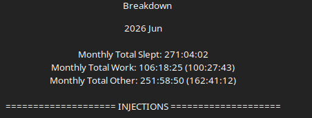
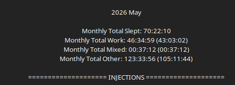
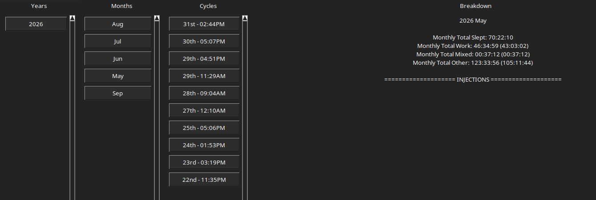

This is a list of my worklogs, what i did for the day. 

It WILL be rambly and unprofessional, as i'm manging hundreds of things at once, and the extra 10 minutes it would take to be "professional" would steal days from me. 

In other news. 

here is a link to the [Trello](https://trello.com/b/cfkeg7ga/ardron-universe-public)

So you can keep track of what i SHOULD be doing.

---

This tracking of work hours and such into github started in July. 

But due to recent improvements to NullSuite(NullFocus), I can show my hours for May and June as well, but no work logs were posted. 

These images will be posted from most recent to last once the month is finished.

---

(May will be very short hours/total due to only starting on the 22nd when i got NullSuite running.)

---

